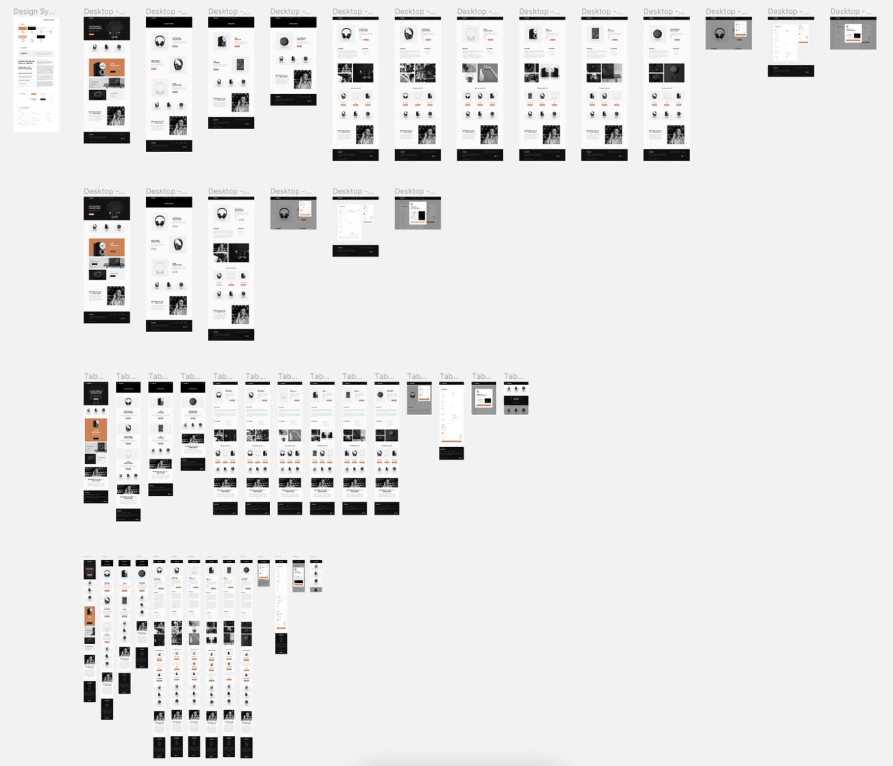

# Diary Of How This Site Was Created

### What am I building?

This site is a multi-page ecommerce store for audio equipment. The Figma
preview gives and overview of the number of different pages and the device 
views. 

### Options, Options, Options

Well, the semi-simple way to create the site would be to store the images in
the file structure and rely on json data for the products. Rather than do
that, I want to use some web technologies and build something more akin to
what would be built in real life.

So with that in mind, what 3rd party services could be used?

**Data** - If I was looking to deploy the site for another person to
manage then a CMS would probably be the best choice. That way they could be
reasonably self-sufficient adding additional products and make minor changes
if required. So many possible options from WordPress to Sanity.io, but I
have heard a few nice things about Storyblok, so we will go for that.

- https://www.storyblok.com/

**Images** - I have no idea how Storyblok deals with images, but I doubt that
it would have the options that Cloudinary purports to have. If there is
reason to then using Cloudinary could be an option here, they seem to have a
pretty robust reputation and can deliver a custom image based on browser and
viewport to keep image file sizes small.

- https://cloudinary.com/

**Cart** - there is a cart element in the design which would ordinarily be
hooked up to a payment provider. Stripe seems the obvious candidate here,
and would be a great addition to the site.

- https://stripe.com/en-gb

### What to build with?

I like SvelteKit and have tested on a few tiny/quick mock-ups but it would
be nice to use it for something a bit more substantial. I will be enabling
TypeScript which will help develop some knowledge and provide more
experience working with TypeScript. All CSS will be custom. I could use
something like Tailwind but as I have a Figma file and CSS is scoped in
Svelte then I see no reason not to take advantage of that, but I will enable
Sass so I can use nesting etc (coming to native CSS soon 👍).

- https://kit.svelte.dev/
